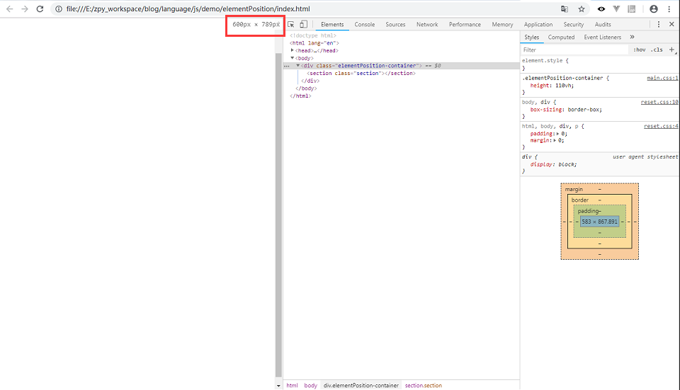
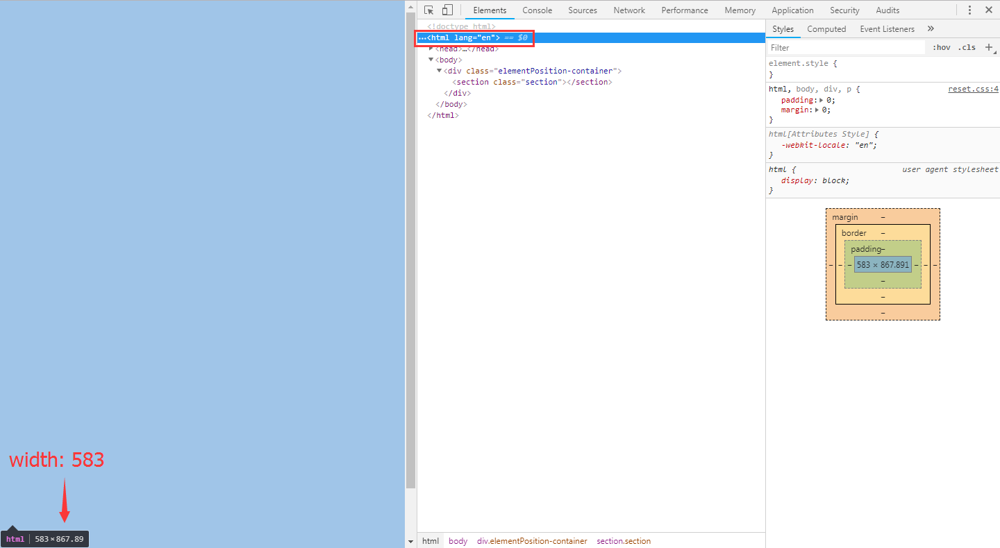
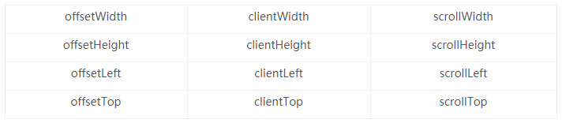
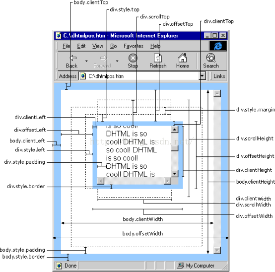
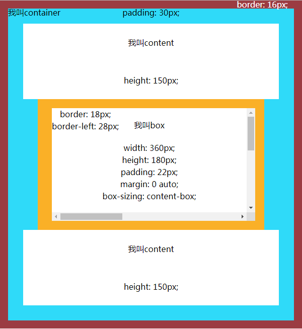

# 页面元素的位置相关

 

**更新动态：**

> 2018.9.18: 前端语言专栏-css-页面元素的位置相关(C)

 

**主要参考：**

[Element - Web API 接口 | MDN](https://developer.mozilla.org/zh-CN/docs/Web/API/Element)

文章demo项目url：'./demo/elementPosition'

 

## 正文

 

**正题：**

首先我们一起了解一些基本知识。

 

**浏览器窗口大小（宽度）和网页大小（宽度）**

如果页面内容大小不足以让浏览器滚动条出现，那么 **浏览器窗口大小（宽度） = 网页大小（宽度）** 。

如果页面内容大小足以让浏览器滚动条出现，那么 **浏览器窗口大小（宽度） = 网页大小（宽度） + 浏览器滚动条大小（宽度）** 。

如图所示，拖拽浏览器窗口使得width=600，选中html标签，获得其width为583。那么有人就会问了，所以浏览器滚动条大小（宽度）就是600-583=17咯？答案将在介绍完本文所有内容后揭晓！

 

**box-sizing**

(参考MDN)

box-sizing 属性用于更改用于计算元素宽度和高度的默认的 CSS 盒子模型。可以使用此属性来模拟不正确支持CSS盒子模型规范的浏览器的行为。

box-sizing 属性可以被用来调整这些表现:

* content-box  是默认值。如果你设置一个元素的宽为100px，那么这个元素的内容区会有100px宽，并且任何边框和内边距的宽度都会被增加到最后绘制出来的元素宽度中。

* border-box 告诉浏览器去理解你设置的边框和内边距的值是包含在width内的。也就是说，如果你将一个元素的width设为100px,那么这100px会包含其它的border和padding，内容区的实际宽度会是width减去border + padding的计算值。大多数情况下这使得我们更容易的去设定一个元素的宽高。

> 一些专家甚至建议所有的Web开发者们将所有的元素的box-sizing都设为border-box。

可能有些同学看到这里就会想说，“说人话！”，好的好的马上来：

一个width设置为200px、border为10px、padding为30px的元素，box-sizing属性当被设置为content-box时，它的盒子宽度为：

200px + 10px * 2 + 30px * 2 = 280px

box-sizing属性当被设置为border-box时，它的盒子宽度为：

200px (是的就没有然后了)

那么同学们稍微想想应该就很清楚了，content-box的盒模型设置width，设置的是它内容的宽度；border-box的盒模型设置width，设置的是它盒模型的宽度。

 

**常见元素位置相关属性**

下表内的元素位置相关的属性，可以理解为必须记住的：

说一点本人的心路历程，一开始自学前端知识的时候，看到很多觉得记忆起来有难度的内容，就会自己给自己找理由找借口，觉得这个肯定是以后要用上的时候再网上搜索就好了，不需要现在记住。然鹅随着后面工作开始做项目，对前端的进一步理解，逐步认识到了之前的想法是不完全对的，至少在一些常用的知识上要达到用的时候不需要通过网上搜索就能使用的程度，最好是能够了解这些知识点的基本概念和常用用法，因为，通常就是这些简单的内容常用的内容，前端学者会比复杂的东西更加不注重它们，但是恰巧就是由于这个现象，导致了前端学者的分化。 **一个优秀的前端，往往能在这些细节上做的非常好，因为他们相对别人肯花时间做别人不会做的事情，那自然就比别人了解的多些，进步的快些。** 希望大家都能养成这个良好的习惯，把你认为是简单的东西，给自己定个小计划，按照计划去掌握他们！

那好了肯定就会有人想问，哪些是属于所谓的简单的常用的知识呢？其实很简单， **只要是你认为可能会经常用得到的知识，你觉得应该是特别有用的知识，再加上之后工作上实际用到的频率很高的知识，这些所有加起来，就是了！** 学习本来就是学无止境的，如果你真的想学好前端，那就要把这些知识当做自己最爱的东西去对待，要跟它们亲密接触，不要排斥它们~

咳咳好！我们继续正题！

首先我觉得是有必要在这里贴上表内的各个属性的介绍的：（参考自MDN，文首有链接！）

 
 

* offsetWidth:

是一个只读属性，返回一个元素的布局宽度。一个典型的（译者注：各浏览器的offsetWidth可能有所不同）offsetWidth是测量包含元素的边框(border)、水平线上的内边距(padding)、竖直方向滚动条(scrollbar)（如果存在的话）、以及CSS设置的宽度(width)的值。

> 这个属性将会 round(四舍五入)为一个整数。如果你想要一个fractional(小数)值,请使用element.getBoundingClientRect().

 

* offsetHeight:

是一个只读属性，它返回该元素的像素高度，高度包含该元素的垂直内边距和边框，且是一个整数。

通常，元素的offsetHeight是一种元素CSS高度的衡量标准，包括元素的边框、内边距和元素的水平滚动条（如果存在且渲染的话），不包含:before或:after等伪类元素的高度。

对于文档的body对象，它包括代替元素的CSS高度线性总含量高。浮动元素的向下延伸内容高度是被忽略的。

> 这个属性值会被四舍五入为整数值，如果你需要一个浮点数值，请用 element.getBoundingClientRect().

 

* offsetLeft:

是一个只读属性，返回当前元素左上角相对于  HTMLElement.offsetParent 节点的左边界偏移的像素值。

对块级元素来说，offsetTop、offsetLeft、offsetWidth 及 offsetHeight 描述了元素相对于 offsetParent 的边界框。

 

* offsetTop:

为只读属性，它返回当前元素相对于其 offsetParent 元素的顶部的距离。

 
 

* clientWidth

属性表示元素的内部宽度，以像素计。该属性包括内边距，但不包括垂直滚动条（如果有）、边框和外边距。

> 该属性值会被四舍五入为一个整数。如果你需要一个小数值，可使用 element.getBoundingClientRect()。

 

* clientHeight

这个属性是只读属性，对于没有定义CSS或者内联布局盒子的元素为0，否则，它是元素内部的高度(单位像素)，包含内边距，但不包括水平滚动条、边框和外边距。

clientHeight 可以通过 CSS height + CSS padding - 水平滚动条高度 (如果存在)来计算.

 

* clientLeft

表示一个元素的左边框的宽度，以像素表示。如果元素的文本方向是从右向左（RTL, right-to-left），并且由于内容溢出导致左边出现了一个垂直滚动条，则该属性包括滚动条的宽度。clientLeft 不包括左外边距和左内边距。clientLeft 是只读的。

 

* clientTop

一个元素顶部边框的宽度（以像素表示）。不包括顶部外边距或内边距。clientTop 是只读的。

 
 

* scrollWidth

元素的scrollWidth只读属性以px为单位返回元素的内容区域宽度或元素的本身的宽度中更大的那个值。若元素的宽度大于其内容的区域（例如，元素存在滚动条时）, scrollWidth的值要大于clientWidth。

> 这个属性会进行四舍五入并返回整数，如果你需要小数形式的值，使用element.getBoundingClientRect().

 

* scrollHeight

这个只读属性是一个元素内容高度的度量，包括由于溢出导致的视图中不可见内容。

scrollHeight 的值等于该元素在不使用滚动条的情况下为了适应视口中所用内容所需的最小高度。 

没有垂直滚动条的情况下，scrollHeight值与元素视图填充所有内容所需要的最小值clientHeight相同。包括元素的padding，但不包括元素的border和margin。scrollHeight也包括 ::before 和 ::after这样的伪元素。

> 属性将会对值四舍五入取整。如果需要小数值，使用Element.getBoundingClientRect().

 

* scrollLeft

属性可以读取或设置元素滚动条到元素左边的距离。

注意如果这个元素的内容排列方向（direction） 是rtl (right-to-left) ，那么滚动条会位于最右侧（内容开始处），并且scrollLeft值为0。此时，当你从右到左拖动滚动条时，scrollLeft会从0变为负数（这个特性在chrome浏览器中不存在）。

> scrollLeft 可以是任意整数，然而：
>
> * 如果元素不能滚动（比如：元素没有溢出），那么scrollLeft 的值是0。
> * 如果给scrollLeft 设置的值小于0，那么scrollLeft 的值将变为0。
> * 如果给scrollLeft 设置的值大于元素内容最大宽度，那么scrollLeft 的值将被设为元素最大宽度。

 

* scrollTop

属性可以获取或设置一个元素的内容垂直滚动的像素数。

一个元素的 scrollTop 值是这个元素的顶部到它的最顶部可见内容（的顶部）的距离的度量。当一个元素的内容没有产生垂直方向的滚动条，那么它的 scrollTop 值为0。

> scrollTop 可以被设置为任何整数值，同时注意：
>
> * 如果一个元素不能被滚动（例如，它没有溢出，或者这个元素有一个"non-scrollable"属性）， scrollTop将被设置为0。
> * 设置scrollTop的值小于0，scrollTop 被设为0
> * 如果设置了超出这个容器可滚动的值, scrollTop 会被设为最大值.

 
 

再贴上一张神图：

网上搜索这部分知识的结果有特别多，贴图也特别多，但是个人觉得还是这张图相对来说描述的最清楚最完整的。（虽然我第一次看这张图也是一脸懵X。。）

接下来就介绍一下怎么理解这12个属性，其实只要看懂了这种图，自然就能形成很牢固的记忆了，那么问题就转移到了怎么看懂这张图。当然有同学发现了图上的属性不止12个，我们暂且忽略掉除了这12个属性之外的其他属性。

有同学肯定就会说了，“这图怎么这么简陋，好丑啊，我看都不想看！”，那好，我就在这个图的基础上写个小demo：

下面我就针对上面的12个属性来描述一下这张图：

> 部分说明：
> * 为了方便计算，故将box的box-sizing设置为content-box
> * 将浏览器窗口拖拉使得body的width为600
> * 各所需参数已在图上标明
> * 部分参数为了回避偶然性结果，特意不设置为十的倍数
> * **计算的结果可在demo项目页面内得到验证，且页面显示的参数值是动态计算的，可通过拖拉浏览器窗口大小获得动态取值**

* offsetWidth:

元素的宽度，包括了内容的width，元素的padding，元素竖直方向滚动条的width和元素的border。故：

offsetWidth = 360px(box的width 和 元素竖直方向滚动条的width) + 22px * 2(box的padding，左右两边之和) + ( 28px + 18px )(元素的border) = 450px

* offsetHeight:

元素的高度，包括了内容的height，元素的padding，元素水平方向滚动条的width和元素的border。故：

offsetHeight = 180px(box的width 和 元素竖直方向滚动条的width) + 22px * 2(box的padding，左右两边之和) + 18px * 2(元素的border) = 260px

* offsetLeft:

元素相对于offsetParent的左边界偏移的像素值，详细说明就是box的左border的左边缘开始一直到父容器的左border的右边缘。由于box的margin水平方向设置为auto，body的width为600，那么box的offsetLeft就可用body的width减去container的border，再减去box的offsetWidth，最后除以2，即：

offsetLeft = ( 600px(body的width) - 16px * 2(container的border) - 450px(box的offsetWidth) ) / 2 = 59px

* offsetTop:

元素相对于offsetParent的上边界偏移的像素值，详细说明就是box的上border的上边缘开始一直到父容器的上border的下边缘。box的offsetTop可用content的height，加上container的上padding，即：

offsetTop = 150px(content的height) + 30px(container的上padding) = 180px

* clientWidth

元素内部宽度，包含box内容的width和box的padding，但不包括垂直滚动条的width。由已知条件可知滚动条的宽度为17px，那么：

clientWidth = ( 360px - 17px )(box内容的width) + 22 * 2(box的padding) = 387px

* clientHeight

元素内部高度，包含box内容的width和box的padding，但不包括水平滚动条的width。由已知条件可知滚动条的宽度为17px，那么：

clientHeight = ( 180px - 17px )(box内容的height) + 22 * 2(box的padding) = 207px

* clientLeft

元素左border的width，即：

clientLeft = 28px

* clientTop

元素上border的width，即：

clientTop = 18px

* scrollWidth

元素内，水平方向上，元素内部（排除了margin），除了border的width以外的所有width总和，包括当内容过多时遮挡的内容部分。由于这个大小不好计算，所以最好依靠浏览器开发者工具去选择box元素查看对应值，或是在控制台通过js获取。

* scrollHeight

元素内，竖直方向上，元素内部（排除了margin），除了border的width以外的所有height总和，包括当内容过多时遮挡的内容部分。同上，由于这个大小不好计算，所以最好依靠浏览器开发者工具去选择box元素查看对应值，或是在控制台通过js获取。

* scrollLeft

元素水平滚动条到元素内部左侧（左border的右边缘）的距离，当没有滚动条出现或是滚动条处于起始位置时，为0，其它情况下随着滚动条滚动动态变化。

* scrollTop

元素垂直滚动条到元素内部上侧（上border的下边缘）的距离，当没有滚动条出现或是滚动条处于起始位置时，为0，其它情况下随着滚动条滚动动态变化。

 

通过上面简单粗暴的描述，相信大家应该对这些属性有了更深一步的了解了，但是这仅仅是最简单的一个场景，项目中难免会遇到比这些复杂的情况，但是万变不离其宗，属性的定义是不变的，只要牢牢掌握，相信项目中遇到的此类问题都能迎刃而解！

本文结束前回应一下上文的浏览器滚动条width计算的问题！

**浏览器滚动条width如何计算**

其实计算浏览器滚动条width的方法有挺多的，这里简单介绍其中的几种常见方法：

* 利用offsetWidth(offsetHeight)和clientWidth(clientHeight)

由于offsetWidth的定义是元素border的width加上元素padding加上元素内容width，是包含垂直滚动条的width的，clientWidth的定义是元素padding加上元素内容width，是不包含垂直滚动条的width的，所以可以利用这一点计算出滚动条width的数值。

还是拿上面的demo举例，box的offsetWidth为450px，clientWidth为387px，水平方向的border分别为28px和18px，那么垂直滚动条的width为：

450px(box的offsetWidth) - ( 28px + 18px )(box的左右border的width) - 387px(box的clientWidth) = 17px

* 利用window的innerWidth和body的offsetWidth

简单介绍window.innerWidth，它是浏览器视口（窗口）的宽度，是包含垂直滚动条的width的，那么垂直滚动条的width就可以通过window.innerWidth与document.body.offsetWidth的差值计算得出：

617px(window.innerWidth) - 600px(document.body.offsetWidth) = 17px

**结尾**

本人认为这部分的知识，只要是项目中涉及到元素计算的，肯定跟这个脱离不了干系！所以特别重要！

希望大家能通过这篇文章学习到自己之前对于这方面知识觉得有空白的地方，相信大家理解了之后一定身心舒畅！有种打通了任督二脉的感觉！

喜欢本文的小伙伴可以随手点一下star！！！
