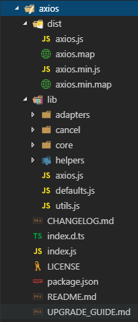

# axios源码解析

 

**更新动态：**

> 2018.11.25: 前端框架专栏-axios-axios源码解析(C)

 

**主要参考：**

* [https://developer.mozilla.org/zh-CN/#](https://developer.mozilla.org/zh-CN/#)

* [https://github.com/axios/axios](https://github.com/axios/axios)

 

## 正文

> **背景：**

> 相信很多童鞋都听过一个说法，就是通过看一些优秀的框架的源码，能让自身的能力提升很快，本人也亲身试毒，因为项目需要，看过iview的源码，后来以补漏的心态看过jquery的源码，虽然都没看完，但是基本已经掌握了核心部分的代码以及核心思想，尽管过程中经历了无数次的百度，但是确实结果是好的，受益匪浅。

> 本期选择对ajax封装的一个库 axios 进行解析，一方面是现在web开发离不开ajax，大家都比较熟悉，另一方面axios已经是许多web项目在ajax方面的不二选择，为什么axios这么受欢迎，自然它的源码就很具阅读的诱惑力，话不多说一起看看。

 

**正题：**

本文解析的axios版本为0.18.0

我们来看看axios的包的根目录下有些什么：

根据文件名也很容易理解对应的含义：

* dist: 项目打包后的目录
* lib: 项目开发目录
* CHANGELOG.md: 更新日志
* index.d.ts: 入口ts文件
* index.js: 入口js文件
* LICENSE: 版权信息
* package.json: npm的package文件
* README.md: 使用文档
* UPGRADE_GUIDE: 升级指南

我们主要关注 /lib index.d.ts index.js 这三部分

从大局上看一下，每个目录翻一翻，发现ts文件就只有根目录的index.d.ts这一个，打开index.d.ts瞧瞧，直观的发现，一堆接口(interface)的定义摆着，有了解的童鞋马上就反应过来，其实这个文件就是用来做类型检查的，通过这种方式来达到类型检查作用，这样的方法其实已经比较常见了，许多的包都在自己的项目里加入了这样的ts文件。

看一下index.js，只有一行引入模块的代码，引入的是/lib/axios.js，这时候是不是感觉正题就要开始了呢？没错！

打开axios.js看看，其实代码量也很少，主要做了几件属于入口文件该做的事情，倒不如说这个文件才是真正的入口文件也不为过，注释什么的也应有尽有，较容易阅读，整理一下它做了这么几件事：

1. 定义创建Axios实例的方法createInstance
2. 调用createInstance新建一个名为axios的Axios实例
3. 给上述实例赋予一个名为Axios的Axios类引用类型变量
4. 给上述实例赋予一个名为create的用于创建Axios实例的工厂函数
5. 给上述实例赋予一个名为Cancel的变量，引用自./cancel/Cancel模块
6. 给上述实例赋予一个名为CancelToken的变量，引用自./cancel/CancelToken模块
7. 给上述实例赋予一个名为isCancel的变量，引用自./cancel/isCancel模块
8. 给上述实例赋予一个名为all的方法，等同于执行Promise.all()
9. 给上述实例赋予一个名为spread的变量，引用自./helpers/spread模块
10. 将上述实例赋值给module.exports和module.exports.default

可以发现唯一需要花点时间看代码的地方是createInstance方法，其他项都是一行带过，一看createInstance方法里面也基本都是引用自其他模块的内容，这下好了到底该从哪里看起呢？不着急，我们还是先从大局看，观察一下/lib下的各个目录和文件：

/adapters: 适配器模块
/cancel: 取消ajax请求模块
/core: 核心模块
/helpers: 一堆协助开发的方法库
defaults.js: 默认配置
utils.js: 一堆协助开发的方法+1

协助开发的方法不作为我们的切入点，等解析过程中用到的时候再说。

相信小伙伴们应该都听过这样的话，“三长一短选最短”，没错就是英语阅读题的“真理”，那我们采用类似的方案先从文件数最少的目录开始看，即/adapters。这里剧透一下，该目录下有一个http.js和一个xhr.js文件，http.js适配的是nodejs，xhr.js适配的是我们web前端开发，即XMLHttpRequest对象，所以这里暂且只分析xhr.js。

 

### /adapters

#### xhr.js

（再剧透一下，貌似一不小心从一个代码量最多的文件开始读了。。）

一看发现其实就是一个方法，参数是一个配置类的对象，返回值是一个Promise对象，接着根据代码很快判断出config参数应该就是使用axios发送ajax请求的config参数

    if (utils.isFormData(requestData)) {
      delete requestHeaders['Content-Type']; // Let the browser set it
    }

isFormData方法引用自utils模块，翻看代码得知这是用来判断参数是否是FormData对象实例的，如果config.data符合，则删除config.headers里面的Content-Type字段，根据注释理解这么做是为了让浏览器负责去设置这个字段的值，我们不需要去人为地给它赋值。由此可以推理出，可能部分浏览器会去判断人为传递的参数中的这个字段如果有值，则不会再给它赋值，这样的话可能会产生无法预料的错误。

    var request = new XMLHttpRequest();
    var loadEvent = 'onreadystatechange';
    var xDomain = false;

    // For IE 8/9 CORS support
    // Only supports POST and GET calls and doesn't returns the response headers.
    // DON'T do this for testing b/c XMLHttpRequest is mocked, not XDomainRequest.
    if (process.env.NODE_ENV !== 'test' &&
        typeof window !== 'undefined' &&
        window.XDomainRequest && !('withCredentials' in request) &&
        !isURLSameOrigin(config.url)) {
      request = new window.XDomainRequest();
      loadEvent = 'onload';
      xDomain = true;
      request.onprogress = function handleProgress() {};
      request.ontimeout = function handleTimeout() {};
    }

接着定义了一些变量，一个名为request的XMLHttpRequest对象实例，缓存ajax请求中监控状态改变的方法名的变量loadEvent，那xDomain是啥？不懂，那就往下看。

下面的if判断意思是，若node环境不为test，全局变量window存在，且含有XDomainRequest字段，XHR对象中没有withCredentials字段，isURLSameOrigin调用结果是否为false。同时满足以上条件时，做往下的一系列操作。那么这里就出现了几个比较陌生的东西，逐个针对地去搜索相关信息了解一下。

 

**XDomainRequest [https://developer.mozilla.org/zh-CN/docs/Web/API/XDomainRequest](https://developer.mozilla.org/zh-CN/docs/Web/API/XDomainRequest)**

> 摘要：

> XDomainRequest是在IE8和IE9上的HTTP access control (CORS) 的实现，在IE10中被 包含CORS的XMLHttpRequest 取代了，如果你的开发目标是IE10或IE的后续版本，或想要支待其他的浏览器，你需要使用标准的HTTP access control。

> 该接口可以发送GET和POST请求

 

**withCredentials [https://developer.mozilla.org/zh-CN/docs/Web/API/XMLHttpRequest/withCredentials](https://developer.mozilla.org/zh-CN/docs/Web/API/XMLHttpRequest/withCredentials)**

> XMLHttpRequest.withCredentials  属性是一个Boolean类型，它指示了是否该使用类似cookies,authorization headers(头部授权)或者TLS客户端证书这一类资格证书来创建一个跨站点访问控制（cross-site Access-Control）请求。在同一个站点下使用withCredentials属性是无效的。

> 此外，这个指示也会被用做响应中cookies 被忽视的标示。默认值是false。

> 如果在发送来自其他域的XMLHttpRequest请求之前，未设置withCredentials 为true，那么就不能为它自己的域设置cookie值。而通过设置withCredentials 为true获得的第三方cookies，将会依旧享受同源策略，因此不能被通过document.cookie或者从头部相应请求的脚本等访问。

 

结合注释的内容可以分析出，这段代码主要是为了解决IE 8/9中跨域请求的问题，提供兼容性支持。

isURLSameOrigin方法，从字面理解应该是判断参数是否符合同源的条件，翻看代码后也验证了这一点。

    // HTTP basic authentication
    if (config.auth) {
      var username = config.auth.username || '';
      var password = config.auth.password || '';
      requestHeaders.Authorization = 'Basic ' + btoa(username + ':' + password);
    }

这里比较简单，判断配置对象参数中的auth字段是否存在并且不为false，若满足则给请求headers添加Authorization字段，值为auth.username和auth.password的base64编码值，btoa方法的引用，取自于window.btoa，若不存在则取自/helpers/btoa，里面是包含了一些兼容性的写法的封装后的btoa方法。

稍微注意一下如果config.auth字段存在，那么请求headers的Authorization字段值是会被重写的，所以如果在这之前有给这个字段赋值的就要小心了。

    request.open(config.method.toUpperCase(), buildURL(config.url, config.params, config.paramsSerializer), true);

    // Set the request timeout in MS
    request.timeout = config.timeout;

这里是初始化一个ajax请求，并赋予配置对象中的timeout参数。buildURL方法的作用是接收配置对象的url、params、paramsSerializer三个参数，用paramsSerializer方法对params进行序列化，再将结果与url拼接并返回。

    // Listen for ready state
    request[loadEvent] = function handleLoad() {
      if (!request || (request.readyState !== 4 && !xDomain)) {
        return;
      }

      // The request errored out and we didn't get a response, this will be
      // handled by onerror instead
      // With one exception: request that using file: protocol, most browsers
      // will return status as 0 even though it's a successful request
      if (request.status === 0 && !(request.responseURL && request.responseURL.indexOf('file:') === 0)) {
        return;
      }

      // Prepare the response
      var responseHeaders = 'getAllResponseHeaders' in request ? parseHeaders(request.getAllResponseHeaders()) : null;
      var responseData = !config.responseType || config.responseType === 'text' ? request.responseText : request.response;
      var response = {
        data: responseData,
        // IE sends 1223 instead of 204 (https://github.com/axios/axios/issues/201)
        status: request.status === 1223 ? 204 : request.status,
        statusText: request.status === 1223 ? 'No Content' : request.statusText,
        headers: responseHeaders,
        config: config,
        request: request
      };

      settle(resolve, reject, response);

      // Clean up request
      request = null;
    };

这里是定义监控状态变化的事件方法。开头的部分主要是处理ajax请求错误的情况，和另一种特殊的情况，接着是将返回的response对象准备好，settle方法主要是处理resolve和reject，将需要返回给对应回调方法的参数准备好，最后将ajax请求对象清空。

往下的两个方法分别定义ajax请求的onerror和ontimeout事件方法，里面均是执行reject回调方法并传递定制的error对象，最后将ajax请求对象清空。

    // Add xsrf header
    // This is only done if running in a standard browser environment.
    // Specifically not if we're in a web worker, or react-native.
    if (utils.isStandardBrowserEnv()) {
      var cookies = require('./../helpers/cookies');

      // Add xsrf header
      var xsrfValue = (config.withCredentials || isURLSameOrigin(config.url)) && config.xsrfCookieName ?
          cookies.read(config.xsrfCookieName) :
          undefined;

      if (xsrfValue) {
        requestHeaders[config.xsrfHeaderName] = xsrfValue;
      }
    }

这里是给请求headers添加csrf/xsrf头的（csrf/xsrf是啥，这部分的内容可大可小，但是很重要！给个参考的中文名叫，“跨源访问”，其余请自行百度！），且只在标准浏览器环境下执行。字段名从config.xsrfHeaderName获取，默认值为X-XSRF-TOKEN，对应值从cookies中的特定字段的value中获取，这个特定字段取自config.xsrfCookieName，默认值为XSRF-TOKEN。

    // Add headers to the request
    if ('setRequestHeader' in request) {
      utils.forEach(requestHeaders, function setRequestHeader(val, key) {
        if (typeof requestData === 'undefined' && key.toLowerCase() === 'content-type') {
          // Remove Content-Type if data is undefined
          delete requestHeaders[key];
        } else {
          // Otherwise add header to the request
          request.setRequestHeader(key, val);
        }
      });
    }

这里是遍历请求headers参数对象，将各个设定值逐个set进XHR对象实例里面，对content-type这个字段又做了一次处理，有印象的童鞋已经发现一开始已经处理过一次了，这里处理的原因和方式跟开头是一致的。

往下基本就是，config里面存在的其余字段，往XHR对象实例对应赋值，方法的话对应地给事件绑定上。

    if (config.cancelToken) {
      // Handle cancellation
      config.cancelToken.promise.then(function onCanceled(cancel) {
        if (!request) {
          return;
        }

        request.abort();
        reject(cancel);
        // Clean up request
        request = null;
      });
    }

这里是处理config中的cancelToken参数。若此字段存在，表示要取消发起请求，执行XHR对象的abort方法，调用reject回调传递cancel参数，将XHR对象实例设为空值。

最后XHR执行send方法发起请求。

 

### /cancel

取消ajax请求模块的主体，浏览一下各个文件容易判断出是CancelToken.js，我们从这开始分析。

 

#### CancelToken.js

从文件底部可以看到这个模块的export就是名为CancelToken的方法，所以直接看这个方法的内容。从注释看，这个方法的作用是发起取消ajax请求的操作。

    if (typeof executor !== 'function') {
      throw new TypeError('executor must be a function.');
    }

这里对参数executor做出了限制，若非function类型则抛出类型错误。

    var resolvePromise;
    this.promise = new Promise(function promiseExecutor(resolve) {
      resolvePromise = resolve;
    });

    var token = this;
    executor(function cancel(message) {
      if (token.reason) {
        // Cancellation has already been requested
        return;
      }

      token.reason = new Cancel(message);
      resolvePromise(token.reason);
    });

这里定义了一个局部变量resolvePromise，并给方法添加一个Promise类型变量，Promise内容是将resolve回调赋值给变量resolvePromise。接着将CancelToken实例对象赋值给局部变量token，然后执行参数executor方法，并传递一个方法，可接收一个名为message的参数。这个方法首先判断了，当前CancelToken实例对象是否已经有名为reason的属性，若存在且不为false，表示取消ajax请求的操作已经执行了，就不再执行后续的操作了，否则往下走，给当前CancelToken实例对象定义reason属性为一个Cancel对象，并将message作为参数，随后执行resolvePromise方法，并将reason属性作为参数。（这里确实很绕，需要花点时间，结合实际场景更易理解）

    /**
    * Throws a `Cancel` if cancellation has been requested.
    */
    CancelToken.prototype.throwIfRequested = function throwIfRequested() {
      if (this.reason) {
        throw this.reason;
      }
    };

这里给CancelToken的原型对象添加了一个名为throwIfRequested的方法，内容是判断当前实例对象的reason是否存在，若是，则throw这个变量，由上面的分析可以知道reason是一个Cancel实例对象。

    /**
    * Returns an object that contains a new `CancelToken` and a function that, when called,
    * cancels the `CancelToken`.
    */
    CancelToken.source = function source() {
      var cancel;
      var token = new CancelToken(function executor(c) {
        cancel = c;
      });
      return {
        token: token,
        cancel: cancel
      };
    };

这里给CancelToken类添加一个名为source的方法，返回一个对象，其中token属性为一个新的CancelToken实例对象，参数是一个方法，会将参数赋值给另一个待return的属性cancel。

 

#### Cancel.js

这个模块同样也只是返回一个名为Cancel的对象，根据注释可以得知，这个对象是用来当一个操作被取消时throw出去的。

    function Cancel(message) {
      this.message = message;
    }

    Cancel.prototype.toString = function toString() {
      return 'Cancel' + (this.message ? ': ' + this.message : '');
    };

    Cancel.prototype.__CANCEL__ = true;

Cancel类只有一个属性message，从构造函数参数中获取，Cancel原型对象添加一个名为toString的方法，返回message的值，还添加一个名为__CANCEL__的属性，并初始化为true，这个属性在这里暂时不能判断能起到什么作用，先略过。

 

#### isCancel.js

    module.exports = function isCancel(value) {
      return !!(value && value.__CANCEL__);
    };

这个模块只输出一个方法，就是用来判断参数是否存在，并且参数的__CANCEL__是否存在，从这我们可以推断出，这个value参数，大概率就是个Cancel对象实例。

 

### defaults.js

前面谈到过这个模块主要是一些默认的配置，因为这个模块在core模块里面可能被频繁调用（事实上在一开始的axios.js就已经被调用过了），所以先看一下里面有些什么。

大概翻阅一下发现果不其然它输出的就是一个默认的ajax请求的配置，我们从defaults对象开始逐个属性分析。

    adapter: getDefaultAdapter()

这个属性容易理解是个适配器，是从一个名为getDefaultAdapter的方法获取的，那么就看看这个方法。

    function getDefaultAdapter() {
      var adapter;
      if (typeof XMLHttpRequest !== 'undefined') {
        // For browsers use XHR adapter
        adapter = require('./adapters/xhr');
      } else if (typeof process !== 'undefined') {
        // For node use HTTP adapter
        adapter = require('./adapters/http');
      }
      return adapter;
    }

这个方法也很好理解，就是判断全局环境下是有XMLHttpRequest还是有process，如果是前者，代表是浏览器环境，那就引入./adapters/xhr这个模块并返回，如果是后者，代表是node环境，那就引入./adapters/http这个模块并返回。

    transformRequest: [function transformRequest(data, headers) {
      normalizeHeaderName(headers, 'Content-Type');
      if (utils.isFormData(data) ||
        utils.isArrayBuffer(data) ||
        utils.isBuffer(data) ||
        utils.isStream(data) ||
        utils.isFile(data) ||
        utils.isBlob(data)
      ) {
        return data;
      }
      if (utils.isArrayBufferView(data)) {
        return data.buffer;
      }
      if (utils.isURLSearchParams(data)) {
        setContentTypeIfUnset(headers, 'application/x-www-form-urlencoded;charset=utf-8');
        return data.toString();
      }
      if (utils.isObject(data)) {
        setContentTypeIfUnset(headers, 'application/json;charset=utf-8');
        return JSON.stringify(data);
      }
      return data;
    }]

这个名为transformRequest的属性，字面理解是转化请求，暂时可以理解为是对ajax请求做一些参数格式化之类的，它的值是一个数组，里面只有一个接收data和headers参数的方法。

首先调用了名为normalizeHeaderName的方法，那就看看这个方法的内容。

    function normalizeHeaderName(headers, normalizedName) {
      utils.forEach(headers, function processHeader(value, name) {
        if (name !== normalizedName && name.toUpperCase() === normalizedName.toUpperCase()) {
          headers[normalizedName] = value;
          delete headers[name];
        }
      });
    };

它做的事情其实正如其名，就是将headers参数的字段名常规化，它会遍历headers对象，如果字段名与normalizedName不全等，但是字段名的大写与normalizedName的大写的值相同，那么就给headers的normalizedName字段赋予对应的值，并将之前不符合规格的字段给删除。

继续阅读transformRequest方法，所以它首先是将headers参数的Content-Type字段给常规化，接着做了一系列的判断，判断data参数是否是FormData、ArrayBuffer、Buffer、Stream、File、Blob中的一种，符合的话就返回data。往下是判断data是否是a view on an ArrayBuffer，符合的话就返回data.buffer。再往下判断data是否是URLSearchParams类型的值，符合的话就执行setContentTypeIfUnset方法：

    function setContentTypeIfUnset(headers, value) {
      if (!utils.isUndefined(headers) && utils.isUndefined(headers['Content-Type'])) {
        headers['Content-Type'] = value;
      }
    }

它会判断headers参数是否定义，并且headers的Content-Type是否未定义，如果都满足则给headers的Content-Type定义为value。

回到URLSearchParams的判断，则是对headers参数做判断，符合的话就给headers的Content-Type设定值为application/x-www-form-urlencoded;charset=utf-8，然后返回data.toString的结果。

再往下，判断data是否是对象类型，如果是，则对headers参数做判断，符合的话就给headers的Content-Type设定值为application/json;charset=utf-8，然后返回JSON.stringify(data)的结果。

如果上面所述的判断都不符合，最后就返回原模原样的data。

    transformResponse: [function transformResponse(data) {
      /*eslint no-param-reassign:0*/
      if (typeof data === 'string') {
        try {
          data = JSON.parse(data);
        } catch (e) { /* Ignore */ }
      }
      return data;
    }]

这个属性字面理解为转化返回的response对象，同样是一个只有一个方法的数组的形式，内容也简单，就是判断data参数的类型如果是string，则JSON.parse(data)一下，并且转化的语句放入try语句块内，防止转化出错阻止了之后的js的执行，最后返回处理后的data。

    /**
      * A timeout in milliseconds to abort a request. If set to 0 (default) a
      * timeout is not created.
      */
    timeout: 0,

    xsrfCookieName: 'XSRF-TOKEN',
    xsrfHeaderName: 'X-XSRF-TOKEN',

    maxContentLength: -1,

    validateStatus: function validateStatus(status) {
      return status >= 200 && status < 300;
    }

最后的部分是设置超时属性timeout，默认值为0，即默认不设置超时。设置xsrfCookieName为XSRF-TOKEN。设置xsrfHeaderName为X-XSRF-TOKEN。设置maxContentLength为-1，这个属性字面理解是最长文本长度，由于没有注释，所以还得结合使用时的实际情况去理解。validateStatus属性是一个方法，判断参数的值是否在200和300之间，这里也好理解，这个参数大概就是请求返回的status的值，如果是2开头则返回true，因为2开头基本是请求成功，否则为false。

    defaults.headers = {
      common: {
        'Accept': 'application/json, text/plain, */*'
      }
    };

    utils.forEach(['delete', 'get', 'head'], function forEachMethodNoData(method) {
      defaults.headers[method] = {};
    });

    utils.forEach(['post', 'put', 'patch'], function forEachMethodWithData(method) {
      defaults.headers[method] = utils.merge(DEFAULT_CONTENT_TYPE);
    });

最后是给defaults的headers赋了默认值，给headers里面遍历生成三个名为delete、get、head的空对象，给headers里面遍历生成三个名为post、put、patch的对象，里面只有一个Content-Type字段，值为application/x-www-form-urlencoded。

 

### /core

终于到了最终的大BOSS，核心模块core，大概翻看一下能知道Axios.js就是核心文件,就从这里开始分析。

 

#### Axios.js

如果对之前所分析的内容有一个整体的理解的童鞋应该已经发现了，写了这么多代码做了这么多事情，其实最核心的东西就是这里面的Axios对象，我们平常使用axios其实就是使用它的一个实例对象，注意是实例对象而不是它本身。话不多说看代码！

    /**
     * Create a new instance of Axios
     *
     * @param {Object} instanceConfig The default config for the instance
     */
    function Axios(instanceConfig) {
      this.defaults = instanceConfig;
      this.interceptors = {
        request: new InterceptorManager(),
        response: new InterceptorManager()
      };
    }

本以为这个对象应该会有特别多的内容，结果就两行？不着急，仔细阅读一下，首先给对象定义一个名为defaults的属性，值取自于构造函数的参数instanceConfig，字面理解就是一个配置对象，接着定义了一个名为interceptors的对象属性，interceptors这个词可能还是挺多小伙伴不太了解，它通常称为拦截器，里面有两个属性分别是request和response，均为InterceptorManager的实例对象，字面理解叫做拦截器管理者，那就看看它里面是啥。

 

#### InterceptorManager.js

    function InterceptorManager() {
      this.handlers = [];
    }

这个模块也只输出这一个方法对象，构造函数只定义一个叫handlers的空数组属性。

    /**
     * Add a new interceptor to the stack
     *
     * @param {Function} fulfilled The function to handle `then` for a `Promise`
     * @param {Function} rejected The function to handle `reject` for a `Promise`
     *
     * @return {Number} An ID used to remove interceptor later
     */
    InterceptorManager.prototype.use = function use(fulfilled, rejected) {
      this.handlers.push({
        fulfilled: fulfilled,
        rejected: rejected
      });
      return this.handlers.length - 1;
    };

这里是给InterceptorManager的原型对象定义一个叫use的方法，这里的注释其实已经解释的很清楚了，它是给栈添加一个拦截器的，这个栈指的就是前面的handlers，两个参数分别是一个待传进来处理的Promise的then和reject，最后返回一个ID，其实就是push的进来的这个对象在handlers中的序号，用于清除当前拦截器。

    /**
     * Remove an interceptor from the stack
     *
     * @param {Number} id The ID that was returned by `use`
     */
    InterceptorManager.prototype.eject = function eject(id) {
      if (this.handlers[id]) {
        this.handlers[id] = null;
      }
    };

这个方法就是用于清除指定ID的拦截器的。

    /**
     * Iterate over all the registered interceptors
     *
     * This method is particularly useful for skipping over any
     * interceptors that may have become `null` calling `eject`.
     *
     * @param {Function} fn The function to call for each interceptor
     */
    InterceptorManager.prototype.forEach = function forEach(fn) {
      utils.forEach(this.handlers, function forEachHandler(h) {
        if (h !== null) {
          fn(h);
        }
      });
    };

这个方法用于执行handlers里面的所有拦截器，若遍历到null，则不做操作。

回到Axios.js，我们先看看底下两个内容比较少的方法：

    // Provide aliases for supported request methods
    utils.forEach(['delete', 'get', 'head', 'options'], function forEachMethodNoData(method) {
      /*eslint func-names:0*/
      Axios.prototype[method] = function(url, config) {
        return this.request(utils.merge(config || {}, {
          method: method,
          url: url
        }));
      };
    });

    utils.forEach(['post', 'put', 'patch'], function forEachMethodWithData(method) {
      /*eslint func-names:0*/
      Axios.prototype[method] = function(url, data, config) {
        return this.request(utils.merge(config || {}, {
          method: method,
          url: url,
          data: data
        }));
      };
    });

注释的解释是，给支持的请求方法添加别名，那看过axios的官方文档的童鞋应该秒懂了，就是给get、post等等方法定义一个简便的直接调用的请求方法，例如axios.get(url[, config])、axios.post(url[, data[, config]])等等。区别只是在于delete、get、head、options四个方法相比post、put、patch是没有data参数的，其余都一样。

最后看一下给Axios的原型对象赋予了一个叫request的方法里面的内容：

首先大家要明白一点是，这个方法就是对于Axios这个对象来说，发出ajax请求的方法。

    // Allow for axios('example/url'[, config]) a la fetch API
    if (typeof config === 'string') {
      config = utils.merge({
        url: arguments[0]
      }, arguments[1]);
    }

这里的注释也说明的很清楚，就是为了让开发者能够像axios('example/url'[, config])这样去使用axios，显得很方便。它的逻辑就是判断第一个参数是否是string类型，如果是，则重新整理一下config参数，让原本的string类型的值加入到第二个参数里面的url属性，那么第二个参数显然就是一个对象，merge新生成的对象代替了旧的config参数。

    config = utils.merge(defaults, {method: 'get'}, this.defaults, config);
    config.method = config.method.toLowerCase();

第一行的merge，逻辑比较严谨，一下子merge四个对象，优先级顺序是，config参数 > 构造函数传进来的config对象 > {method: 'get'}（默认发起get请求的由来） > 全局默认配置对象defaults。然后将method的值大写。

    // Hook up interceptors middleware
    var chain = [dispatchRequest, undefined];
    var promise = Promise.resolve(config);

这里的注释，说实话，我也不太懂。。主要是Hook up，我的理解是挂起，但是也翻译不通，“挂起拦截器中间件”？emmm。。暂且先不管！直接看下面代码。

第二行好理解主要是第一行，定义了一个名为chain的数组变量，字面理解是链，只有一个叫dispatchRequest的变量和一个undefined，看看dispatchRequest是个啥：

 

#### dispatchRequest.js

字面理解，意思是分发请求。直接看它输出的方法的内容。

    throwIfCancellationRequested(config);

这个方法判断config.cancelToken是否存在，是的话则调用它的throwIfRequested方法，之前分析过，它是判断如果取消请求操作已经发出，就throw一个Cancel对象。

    // Support baseURL config
    if (config.baseURL && !isAbsoluteURL(config.url)) {
      config.url = combineURLs(config.baseURL, config.url);
    }

这里针对配置对象的baseURL参数做处理，判断如果baseURL存在，且config.url不是一个绝对路径，则给config.url重新赋值，合并config.baseURL和config.url。

    // Ensure headers exist
    config.headers = config.headers || {};

这里就如同注释所说的，确保headers是个存在的对象，故判断config.headers为空时赋予默认值{}。

    // Transform request data
    config.data = transformData(
      config.data,
      config.headers,
      config.transformRequest
    );

这里针对config.data做处理，用config.transformRequest方法对config.data和config.headers做处理，并返回给config.data。

    // Flatten headers
    config.headers = utils.merge(
      config.headers.common || {},
      config.headers[config.method] || {},
      config.headers || {}
    );

    utils.forEach(
      ['delete', 'get', 'head', 'post', 'put', 'patch', 'common'],
      function cleanHeaderConfig(method) {
        delete config.headers[method];
      }
    );

这里是让headers回归正常，符合浏览器的headers的格式，因为之前可能对headers赋予了一些暂存的字段值，现在一并将它们merge，优先级顺序是 config.headers > config.headers[config.method] > config.headers.common，然后遍历清除掉headers里面暂存的以方法名为字段名的值。

    var adapter = config.adapter || defaults.adapter;

这里定义适配器变量，若config配置对象定义了适配器，则使用config的，否则使用全局默认配置的适配器。

    return adapter(config).then(function onAdapterResolution(response) {
      throwIfCancellationRequested(config);

      // Transform response data
      response.data = transformData(
        response.data,
        response.headers,
        config.transformResponse
      );

      return response;
    }, function onAdapterRejection(reason) {
      if (!isCancel(reason)) {
        throwIfCancellationRequested(config);

        // Transform response data
        if (reason && reason.response) {
          reason.response.data = transformData(
            reason.response.data,
            reason.response.headers,
            config.transformResponse
          );
        }
      }

      return Promise.reject(reason);
    });

返回值是一个用适配器发出ajax请求后返回的Promise，当请求成功时，再调用一次throwIfCancellationRequested方法，接着用config.transformResponse处理response.data和response.headers，结果赋值给response.data，最后返回response；当请求失败时，调用isCancel判断一下reason是否未定义，符合则执行throwIfCancellationRequested方法，然后判断reason.response是否存在，符合则用config.transformResponse转化reason.response.data和reason.response.headers，结果赋值给reason.response.data，最后返回一个结果为reject的Promise，传参reason。

回到Axios.js，因此chain的第一个参数，事实上是一个ajax请求完返回的Promise。

    this.interceptors.request.forEach(function unshiftRequestInterceptors(interceptor) {
      chain.unshift(interceptor.fulfilled, interceptor.rejected);
    });

    this.interceptors.response.forEach(function pushResponseInterceptors(interceptor) {
      chain.push(interceptor.fulfilled, interceptor.rejected);
    });

    while (chain.length) {
      promise = promise.then(chain.shift(), chain.shift());
    }

    return promise;

最后这部分，依次是，遍历interceptors的request，将数组内的拦截器逐个unshift进chain的开头；遍历interceptors的response，将数组内的拦截器逐个push进chain的末尾；执行while循环，依次执行chain的拦截器和ajax请求，返回最后执行的promise。

 

**结尾**

axios大部分代码基本分析了一遍，肯定还有部分代码没有摆出来的，或者是摆出来的代码分析的不到位，甚至有错误的，大家都可以提出来交流一下。剩下的代码大家有兴趣可以自己翻阅，应该都比较好理解，其实说难也没什么难的，不就是个ajax的封装包嘛对吧，我一直坚信一个定律，看一遍不会不要紧，看两遍，三遍，看多几次，每一次总会比上一次看有收获！所以为了有所成长，请坚持下去！
